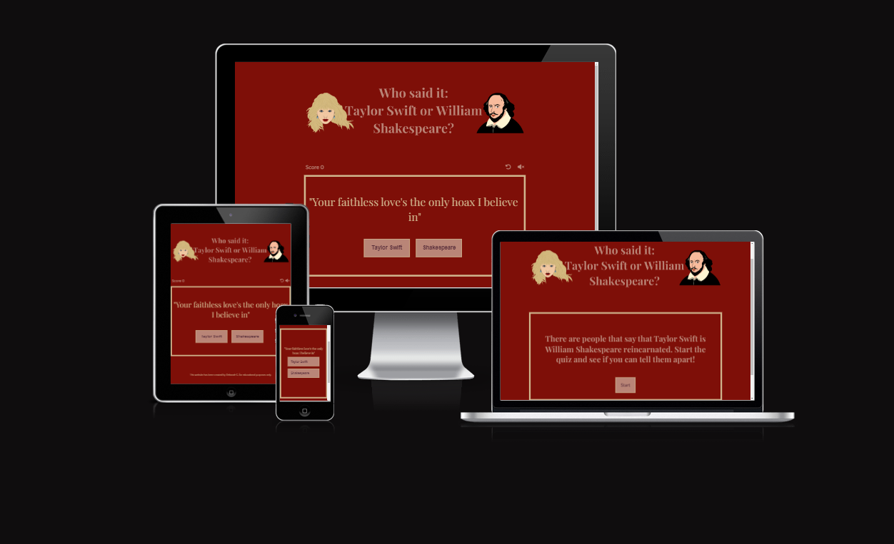

[View the live project here](https://debear92.github.io/who-said-it/)

Who Said It it's quiz game where users are presented with a prompt that could either be a Taylor Swift's lyric or a Shakespeare's quote. The user will have to choose the right answer and get a score of 6 or beyond to win the game.

# Table of Contents
- [User Experience](#user-experience)
 - [User Stories](#user-stories) 
 - [Design](#design)
- [Features](#features)
  - [Homepage](#homepage)
  - [Footer](#footer)
  - [Quiz Page](#quiz-page)
  - [Result Screen](#results-screen)
  - [Responsivness](#responsivness)
  - [Features to implement](#features-to-implement)
- [Technologies Used](#technologies-used)
- [Testing](#testing)
  - [Validator](#validator)
  - [Lightouse](#lighthouse)
  - [Accessibility](#accessibility)
- [Bugs/Issues](#bugsissues)
  - [Fixed](#fixed)
  - [Unfixed](#unfixed)
- [Deployment](#deployment)
- [Credits](#credits)
  - [Media](#media)
  - [Code](#code)
- [Acknowledgements](#aknowledgments)

# User Experience

## User Stories

| ID | ROLE | ACTION | GOAL |
|-----------------|:-------------|:---------------:|:---------------:|
| 1 | USER | As a user, I want to be able play the Who Said It Quiz| So I can test my knowledge|
| 2 | USER | As a user, I want to be able to navigate around the interface easily | so that the game doesn't become a frustrating experience|
| 3 | USER | As a user, I want to be able to play the quiz across all devices | So I can play the quiz while on the go or in different locations |
| 4 | USER | As a user, I want to be able to start the game when I am ready | So I can be ready |
| 5 | USER | As a user, I want to see the right answer highlighted if I answer wrong | So I can see where I went wrong |
| 6 | USER | As a user, I want to be able to start a new game when the current one ends | So I can see if I can beat my score|

## Design

- To guide the development of the website wireframes were designed through [Balsamiq](https://balsamiq.com/). These wireframe were only an initial guide and some features appear different in the final product.
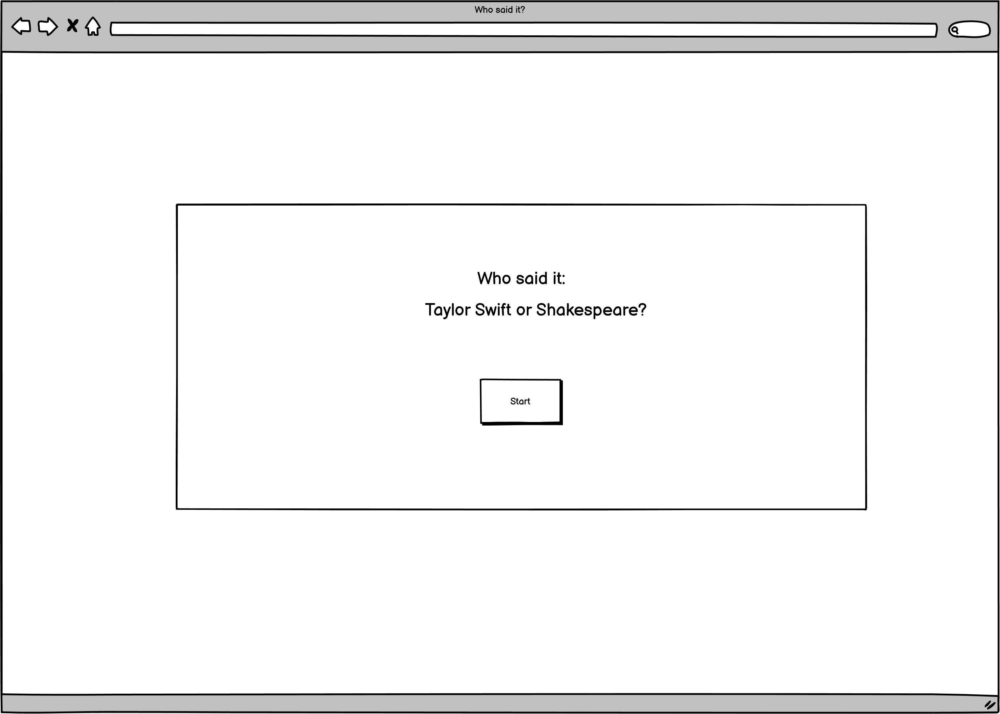
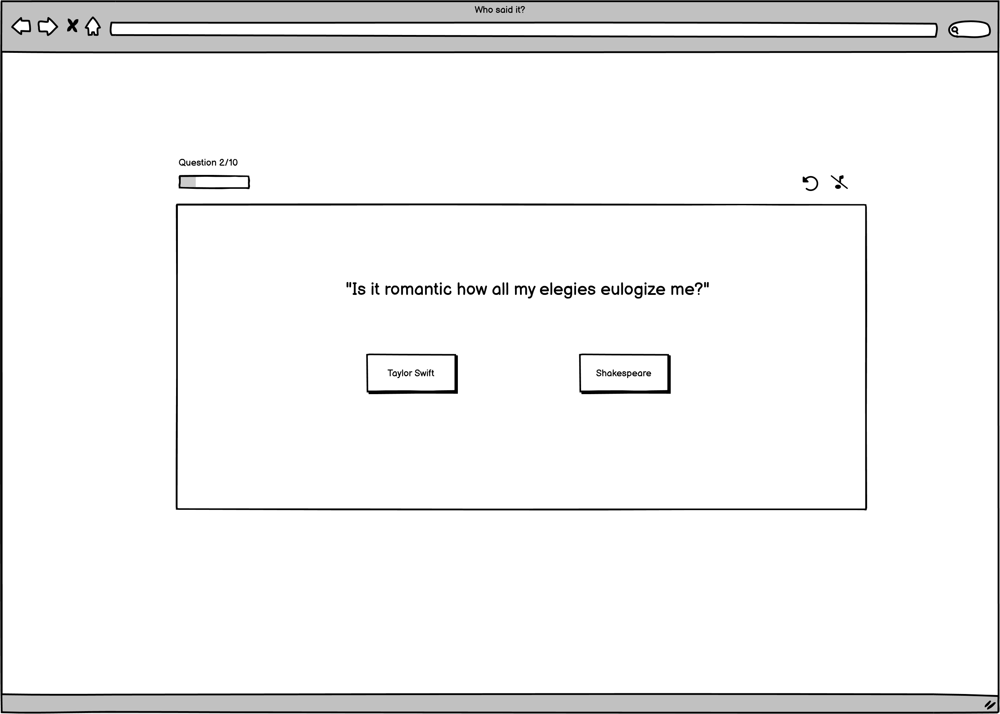
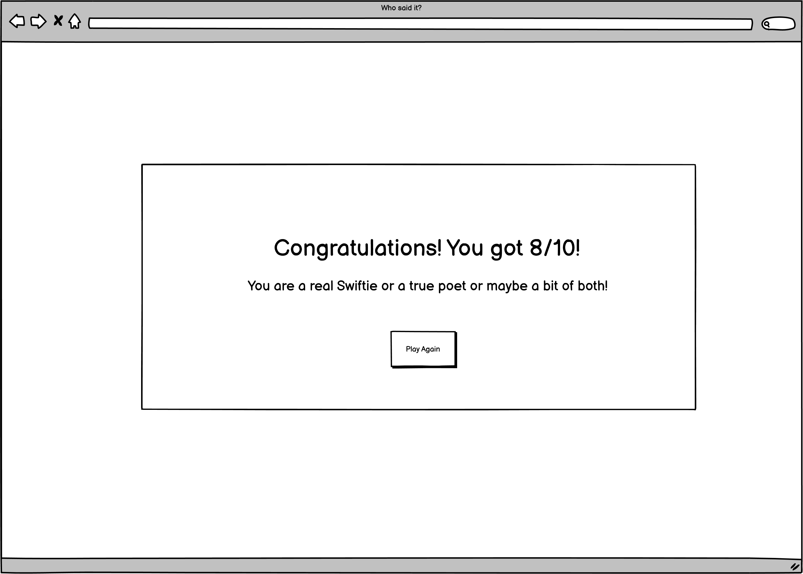
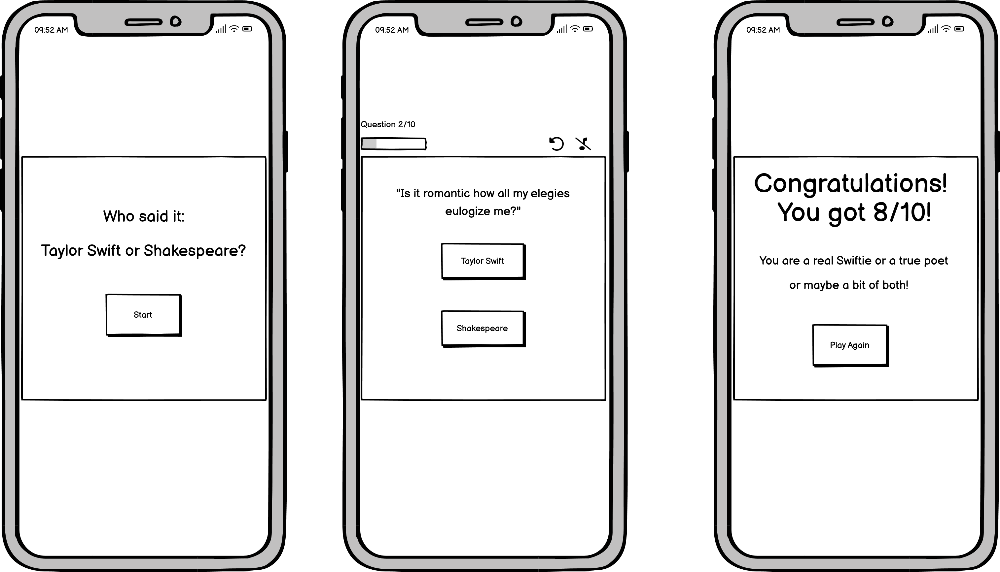

- A color pallet was generated using [ColorSpace](https://mycolor.space/). I started from the color #80000, Maroon, the title of a Taylor Swift song that I really like.

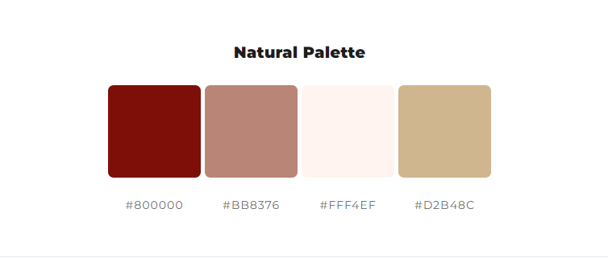

Two fonts were paired togheter for the website. The two fonts were chosen on [Google Fonts](https://fonts.google.com/)

- Playfair Display was used for the logo and the questions. 

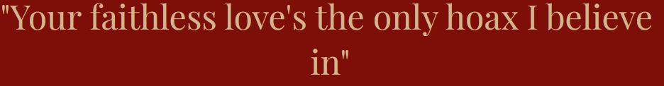

- Quattrocento Sans was used in the smaller text of the page. 

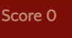

# Features

## Homepage

- The homepage provide the user with the purpose of the game

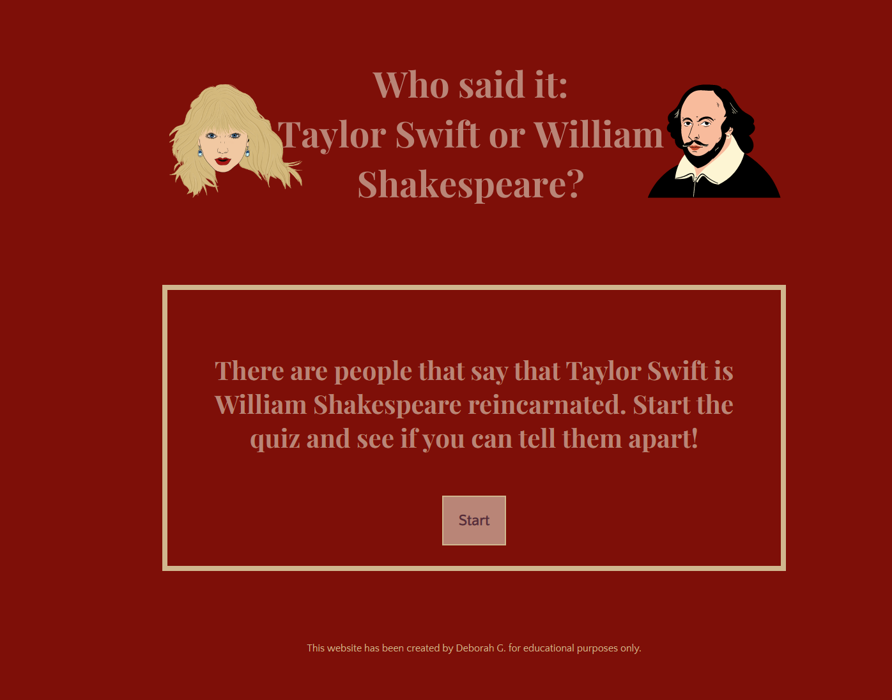

## Footer

- In this section of the page the user can find a link to the Github profile of the author of the website
- In this section the user is informed that the website has been created for educational purposes only

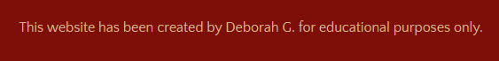

## Quiz Page 

- This page is the core of the application. The user will be asked to answer 10 questions. 
- For each question the user will be presented with two options: Taylor Swift or Shakespeare. Once the user select an option they won't be able to change it.
- If a user answer a question correctly a correct answer sound will be played and the selected option will turn green. The score will increment by one.
- If a user answer a question incorrectly a wrong answer sound will be played and the selected option wil turn red. The score will remain the same.
- Once the question is answered, the user will presented with a short explanation on why the answer was right or wrong by informing the user which song or play the lyric is from.
- On top of the question, the user will find a bar that will show their current score and will allow the user to restart the game from the beginning and toggle on or off the audio.

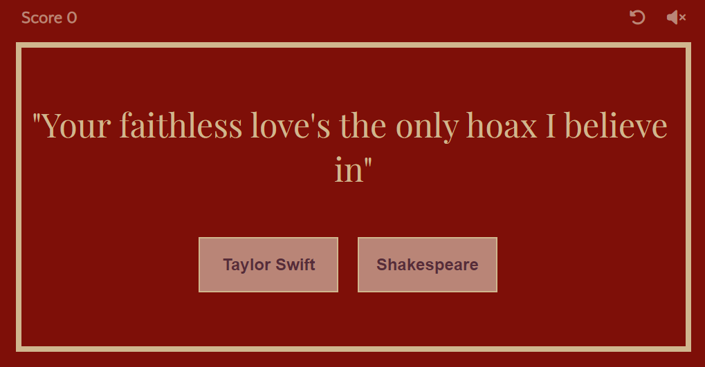

## Results Screen

- After answering all the 10 questions users will be able to see their total score. 
- If the audio is switched on a Taylor Swift song will play while the scores are displayed.
- The user can start the game again from the start and reset their score.

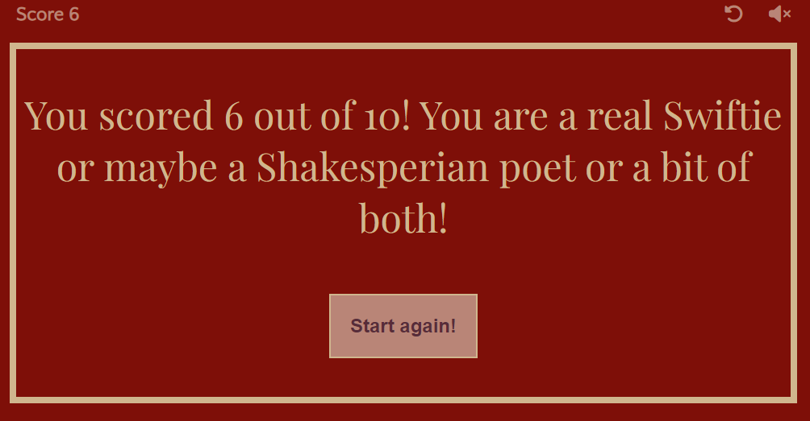

## Responsivness

- The website was built to be fully responsive on screens from 300px wide and above.
- The responsivness has been reached with the use of different methods, mainly media queries and the use of flexbox.

## Features To Implement

- Add different levels of difficulties that the user can choose from so that the game become more challenging
- Option to store the results for returning users so that they can see if they improved their scores since the previous time they played the game

# Technologies Used 

- Wireframes were designed in [Balsamiq](https://balsamiq.com/).
- The website is built only using HTML, CSS and Javascript.
- [Gitpod](https://gitpod.io/) - to write the code.
- [Github](https://github.com/) - to store the repository of the website.
- [Github Pages](https://pages.github.com/) - to deploy and host the website.
- [Google Dev Tools](https://developer.chrome.com/docs/devtools/) - to troubleshoot issues and test responsivness through various screen sizes.
- [Convertio](https://convertio.co/webp-jpg/) - to convert all images to webp..
- [Favicon](https://favicon.io/) - to create favicon of the website.
- [Canva](https://www.canva.com/) - to design the favicon, logo and 404 image.
- [ColorSpace](https://mycolor.space/) - to generate color pallet.
- [Google Fonts](https://fonts.google.com/) - to import the fonts used in the website.
- [Am I Responsive?](https://ui.dev/amiresponsive) - to show responsivness of the website across multiple devices.

# Testing

To test my website I have opened it on different devices, to see if it was working as expected.

- Browser tested:
  - Chrome
  - Firefox
  - Edge
  - Safari

- Operating systems:
  - Windows
  - Android
  - iOS

  |Action | Expected behavious | Result|
  |-------|--------------------|-------|
  |Copy url of the browser and paste it in browser. Press enter | Browser should load index.html | Pass |
  |Scale up the window | The contentent should not stretch over a certain size | Pass |
  |Scale down the window | The contentent should be visible without having to scroll horizontally | Pass |
  |Click on start game button on the home page. | Ensure the correct page opens. | Pass |
  |Click on the answer options. | The button should turn green for correct answer, red for wrong answer | Pass |
  |Click on the audio icon to switch on and off the audio. | Page should load with the audio being set to off by default. | Pass |
  |Click on the restart game icon or button.| Score should go back to zero, questions will start again from number one. | Pass |
  -------

## Validator

- HTML
  - No errors were returned when passing the final version through the official [W3 Validator](https://validator.w3.org/)

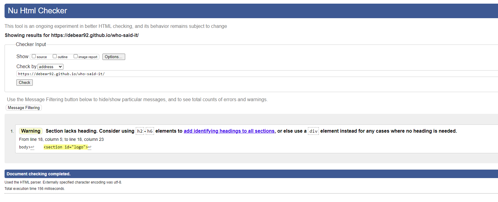

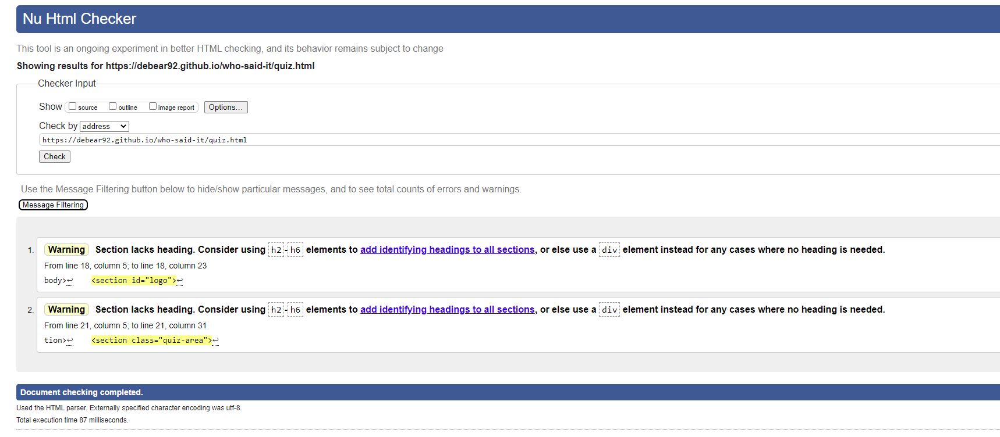

- CSS
  - No errors were found when passing the final version through the official [Jigsaw validator](https://jigsaw.w3.org/css-validator/)

  

- Javascript
  - No errors were found when passing the final version through the official [JSHint](https://jshint.com/). Many of the warning relate to undefined variable or function, this is due to the fact that two separate Javascript files were used for this project and those variables or functions were called in the other page.

  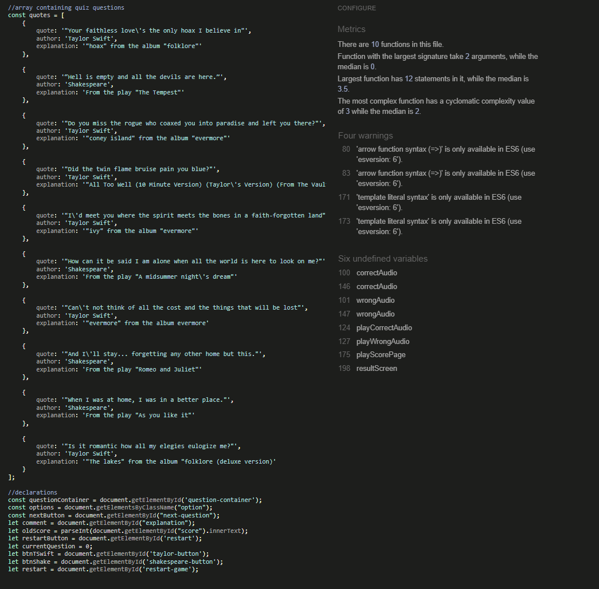
  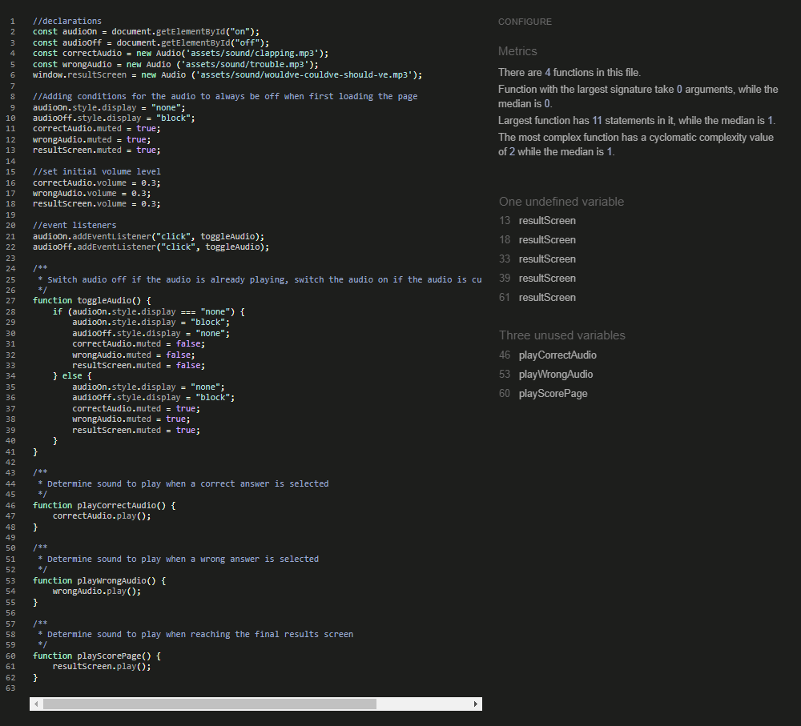

## Lighthouse

Every page was tested through Lighthouse for both desktop and mobile.

- Desktop

  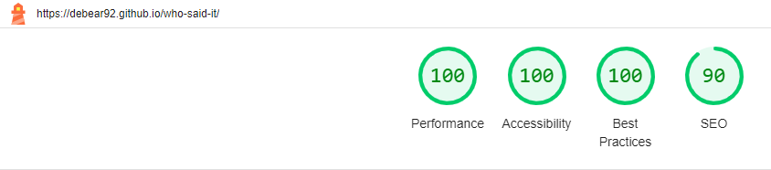
  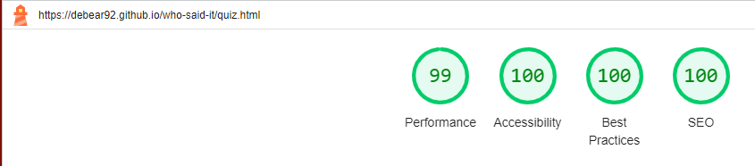
  
- Mobile

  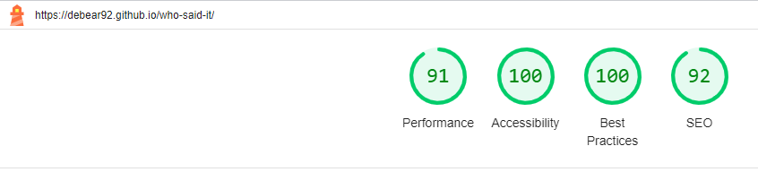
  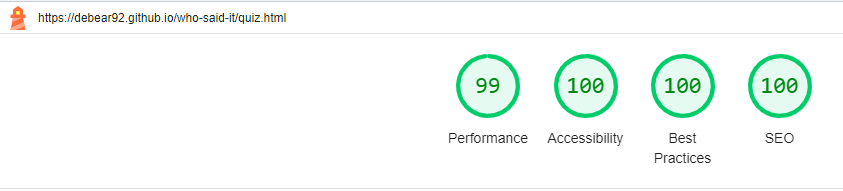
  
## Accessibility

All pages were tested through [Wave](https://wave.webaim.org/) for accessibility

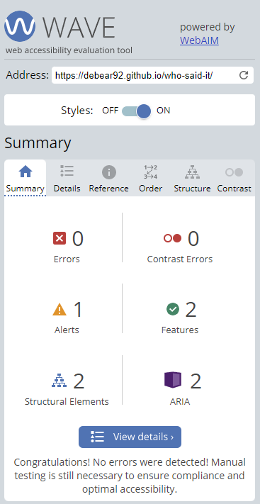
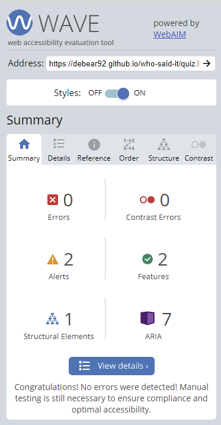
        
# Bugs/Issues

## Fixed

- The function to start the game is called when the DOM loads. The startGame function was applying a display: none to the "Next" button and the "Start again!" button. With some connection, when the page was loading slightly slower the two buttons would appear briefly on the screen before disappearing. I was able to easily fix this by applying the display: none directly on CSS file instead.

## Unfixed

- There are no known unfixed bugs.

# Deployment

The site was deployed to GitHub pages. The steps to deploy are as follows:
  - In the GitHub repository, navigate to the Settings tab.
  - From the source section drop-down menu, select the Master Branch.
  - Once you've selected your branch and root directory, click "Save" to deploy your website. GitHub will generate a URL where your website will be hosted (usually in the format username.github.io/repository-name).

The live link can be found here - [Live Website](https://debear92.github.io/who-said-it/).

## To fork the repository on GitHub

A copy of the GitHub Repository can be made by forking the GitHub account. Changes can be made on this copy without affecting the original repository.

1. Log in to GitHub and locate the repository in question.
2. Locate the Fork button which can be found in the top corner, right-hand side of the page, inline with the repository name.
3. Click this button to create a copy of the original repository in your GitHub Account.

## To clone the repository on GitHub

1. Click on the code button which is underneath the main tab and repository name to the right.
2. In the 'Clone with HTTPS' section, click on the clipboard icon to copy the URL.
3. Open Git Bash in your IDE of choice.
4. Change the current working directory to where you want the cloned directory to be made.
5. Type git clone, and then paste the URL copied from GitHub.
6. Press enter and the clone of your repository will be created.

# Credits

## Media

- The Taylor Swift and Shakespeare cartoonized icons used in the logo are part of [Canva](https://www.canva.com/) Pro plan. 
- The icons used on the top bar of the game to restart the game and toggle audio on or off are from [Fontawesome](https://fontawesome.com/)
- The sounds for correct and wrong answer are from [Zedge](https://www.zedge.net/)
- The song at the end of the quiz was downloaded from Taylor Swift's official [Youtube Channel](https://www.youtube.com/watch?v=B-MfwP_RmHY)

## Code

- For a general idea of how a quiz with Javascript is made I watched this video: [Build A Quiz App With JavaScript](https://youtu.be/riDzcEQbX6k) from 
[Web Dev Simplified](https://www.youtube.com/@WebDevSimplified)
- For the checkAnswer function: [Passing Arguments to Event Listeners in JavaScript](https://plainenglish.io/blog/passing-arguments-to-event-listeners-in-javascript-1a81bc397ecb)

# Aknowledgments

This project was created as part of my Software Developer course at Code Institute. I would like to thank my mentor and the slack community for the support received during the development of this project. 